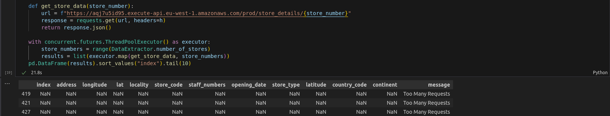
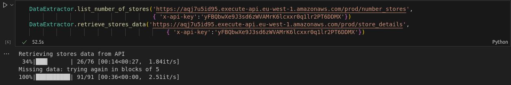
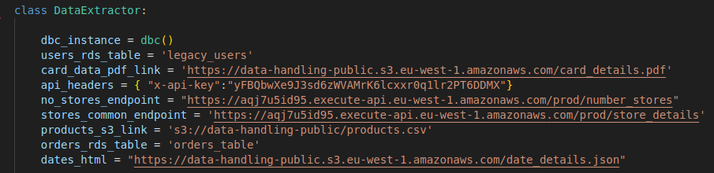

# Multinational Retail Data Centralisation

### Table of Contents
- The project
- Installation instructions
- Usage instructions
- File structure of the project
- License information


## The project
The aim of this project is to create a system that is capable of retrieving and cleaning data from multiple different sources before uploading it to an SQL database. It should assist users in accessing all of their data from one location, allowing businesses to make more data-driven decisions and get a better understanding of their sales.

More specifically, the exact tasks that the methods are designed to perform are as follows:

- Access stored user credentials
- Retrieve a table of users and addresses from a given Amazon RDS instance
- Retrieve a table of card details and user IDs from a PDF document using tabula
- Retrieve a table of store details from an API with given endpoints and headers
- Retrieve a table of product details from an Amazon S3 bucket using a provided S3 address
- Output a table of date details from a json file using a given HTML
- Clean all retrieved data
- Upload all cleaned data to an SQL database called 'sales_data'
- Run a default SQL query to format data types, implement a list of specified custom features to the database and add primary & foreign keys to the correct columns of each table in order to create a star-based schema
- Run a selection of sample SQL queries on the new database


While building this repo, I have learned the importance of generalisation when writing class methods. While refactoring, I had noticed entire paragraphs of code that consisted of thematically similar lines and I subsequently created additional class methods to handle this. The ```universal_replace()``` method within ```DataCleaning```; for example, is a modified ```replace()``` method capable of taking DataFrame positional information as well as remove & replace values and an optional condition as arguments. This enabled me to use a common method to make mass changes to my DataFrame, which meant that I could loop the common method; passing a dictionary as an argument, thus making the code more scalable and user-friendly.

Whilst working on the code for the ```retrieve_stores_data()``` method, I encountered a problem; there didn't appear to be any documentation supplied with the API information, all I had to work with was a set of headers and an API endpoint. 

Initially, I tried using a ```for``` loop in a list comprehension to iterate through each entry, but since the loop had to run hundreds of times with the connection taking place inside the loop, the code was taking up to 3 minutes to execute.
I tried a few common methods to connect to multiple endpoints at once, but none of them were compatible with the API.
After some research, I discovered that I was able to use the ```ThreadPoolExecutor``` method of the ```concurrent.futures``` extension to connect to the API multiple times at once to eliminate the need for a loop.

This, however, presented a new problem. Once the database had been extracted using ```ThreadPoolExecutor```, several of the row values had changed to NaN and a new series ```message``` had been created.
On the NaN rows, the value in ```message``` read 'Too Many Requests'.

So, with the knowledge of how to retrieve the complete dataframe in 3 minutes as well as how to retrieve an incomplete dataframe in a matter of seconds, it was simply a matter of reworking the code with a 'while' loop to reduce the block size by 1 if the ```message``` column was created.


By incorporating these changes, I was able to cut down the runtime of this method to less than a minute.


## Installation instructions
### Suggested pre-requisites:
- conda
- pip
- pgAdmin 4 (optional) 
- requirements.txt extension(mentioned in __Installation__ section)

### Installation

Before the classes and their contained methods are used, the dependencies must be installed. The standard  'requirements.txt' file contains the virtual environment.

On the command line, navigate to the downloaded repository folder and run:
```
pip install -r requirements.txt
```
It is also necessary to create a blank SQL database, pgadmin4 will work for this.


## Usage instructions

Once the dependencies are installed and the destination SQL database has been created, the python code can be executed.

An execution file ```build_sql_database.py```has been included, which performs the following actions:
- Ask the user for relevant credentials
- Define an instance of DataExtractor
- Extract the required dataframes into the DataExtractor instance
- Clean the dataframes stored in the DataExtractor instance
- Upload all of the cleaned dataframes into postgresql
- Run an SQL query to format the database

This can be executed from the command line by navigating to the project folder and running:

```
$ python3 build_sql_database
```


Alternatively, the user can create three YAML files in the downloaded repository folder, containing their credentials for AWS and PostgreSQL, as the DataExtractor class will need to access password-protected information:
- db_creds.yaml
    
    Should contain credentials for the source Amazon RDS database in the following format:
    ```
    TYPE: postgresql
    RDS_HOST: rds host
    RDS_PASSWORD: rds password
    RDS_USER: rds username
    RDS_DATABASE: postgres
    RDS_PORT: 5432
    ```

- postgres_creds.yaml

    Should contain credentials for the destination PostgreSQL database in the following format:
    ```
    database_type: postgresql
    database: database name
    user: postgres
    password: password
    host: localhost
    port: 5432
    ```

- aws_creds.yaml

    Should contain AWS access keys in the following format:
    ```
    access_key : access key,
    secret_access_key : secret access key
    ```
### Extracting & cleaning the data

Once these YAML files have been created, the data can be retrieved. This is accomplished with the following code:
```
from database_utils import DatabaseConnector
from data_extraction import DataExtractor
from data_cleaning import DataCleaning

de_instance = DataExtractor()
de_instance.extract_all()
```

After all of the data has been retrieved, the ```clean_all()``` method of the ```DataCleaning``` class may be called, by passing an instance of ```DataExtractor``` as an argument:


This will clean all of the data currently stored within the ```DataExtractor``` instance:
```
DataCleaning.clean_all(de_instance)
```

### Uploading the data
Finally, the ```DatabaseConnector.upload_all()``` method of the DatabaseConnector class can be called by passing the instance of ```DataExtractor``` as the argument:

```
DatabaseConnector.upload_all(de_instance)
```

When ```upload_all()``` is called, it will ask for user input(Y/N) to determine whether or not to use default values for database names, if the user selects 'Y', the following database names will be used:
- 'dim_users' 
- 'dim_card_details'
- 'dim_store_details'
- 'dim_products'
- 'orders_table'
- 'dim_date_times'


Alternatively, if the user selects 'N', they will have the option to choose the names of the respective tables. This, however, will prevent the alteration script from running, since it uses specific table names to make changes to the the SQL database. 
If you decide to use your own database names, please be aware that you will also need to edit both the 'sql_alteration_script' & 'sql_query_script' plain text files and update the table names within the SQL queries. This is potentially a future development that will need addressing depending on how versatile the user needs the code to be.

### Formatting
At this stage, if the user has selected the default database values, the ```DatabaseConnector.run_sql_alteration_script()``` method may be called to format the database and create Primary & Foreign keys to complete the star-based database schema.

NOTE: There is an additional plain text document 'sql_query_script' containing several sample SQL queries that may be used to query the database.

## File structure of the project
### database_utils.py
This module contains the ```DatabaseConnector``` class, which contains the necessary methods for reading credentials, connecting to Amazon RDS and uploading to PostgreSQL. I have also included an ```upload_all()``` method that will upload all of the currently specified dataframes together, as well as a ```run_sql_alteration_script()``` method that accesses the relevant attached plain text document to run an SQL query to adjust the database as required once it has been imported.


### data_extraction.py
This contains the ```DataExtractor``` class, which is comprised of several methods capable of retrieving data from the following formats:

- Amazon RDS database
- PDF document
- API endpoint
- Amazon S3
- json

All of the given input information required to retrieve the data has been used to set the class attributes:



The ```extract_all()``` method then calls each relevant method within the class and passes these attributes as respective arguments to download all of the data from each of the different sources. 


``` read_rds_table(table_name, dbc)```:

Takes a table name and an instance of the DatabaseConnector class as arguments and returns the relevant table from Amazon RDS as a Pandas DataFrame.

```retrieve_pdf_data(link)```:

Takes a PDF link as an argument and returns the information as a Pandas DataFrame.

```list_number_of_stores(no_of_stores_endpoint, headers_dictionary)```:

Takes an API endpoint and headers dictionary as arguments and returns the number of available records

```retrieve_stores_data(endpoint, headers)```:

Takes an API endpoint and headers dictionary as arguments, returning a Pandas DataFrame containing the information from the API.

```extract_from_s3(address)```:

Takes an Amazon S3 address as an argument and casts the information into a Pandas DataFrame


#### data_cleaning.py
The ```data_cleaning``` module contains the ```DataCleaning``` class, which holds a variety of separate methods for cleaning all of the data retrieved from the various sources.

```clean_all()```; as mentioned above, takes an instance of ```DataExtractor``` (after the ```extract_all``` method has been called), and replaces the instance dataframes with their cleaned counterparts.

```clean_user_data()``` Takes the 'users' rds DataFrame as an argument and correctly formats phone numbers, dates and country codes, and also removes any NULL or erroneous entries

```clean_card_data()``` takes a DataFrame of card details as an argument and cleans the data to remove any erroneous values, NULL values or errors with formatting.

```clean_stores_data()```  Takes the 'stores_df' retrieved from the API endpoint as an argument, removes the extra 'index' series, fixes the erroneous 'lat/latitude' columns and also formats the 'address', 'continent' and 'opening_date' columns, returning the cleaned DataFrame.

```clean_products_data()``` Takes the 'products_df' retrieved from S3 bucket as an argument, fixes spelling mistake in 'removed' series, gets ridof any null or erroneous rows, removes unnecessary index andformats the 'date_added' series. Finally, calls the ```convert_product_weights()``` method and returns the DataFrame
        
```clean_orders_table()``` Takes the 'orders_table' retrieved from RDS as an argument, and removes unnecessary columns as required, returning the DataFrame

```clean_date_details()``` Takes the 'date_details' table as an argument, removes erroneous/null values and casts the 'time_period' as a category, returning the DataFrame.

```format_phonenumber()``` is a method called within ```clean_user_data()```, once the 'phone_number' series has been pre-formatted. It formats phone numbers internationally by country code and raises an error if there are any entries that don't format correctly.

The ```universal_replace()``` method; as mentioned earlier, is a modified ```replace``` method that takes the following arguments:
- df: The DataFrame to be edited
- column: The series within the DataFrame which contains the values to be edited
- remove: The specific value(s); in '```str```' format (or optionally a list of strings if there are multiple values) to remove from all of the values in the column
- replace: The specific value; in '```str```' format to replace the removed value, if the user simply wants to delete the selection, the value can be set to ```''```
- condition(optional): Allows the user to specify certain rows when necessary by using one or more expressions
- instance(optional): Allows the user to decide whether the replacement takes place on the __first instance__ or __all instances__ of the 'replace' value in the data entry. The default is set to '1' (first instance), but if ```instance=0``` is passed as an argument, all instances will be affected.

Although not all of the replacements in ```DataCleaning``` are compatible with this method, it has been very helpful in keeping the cleaning methods tidy and consistent, and its utility is further extended with the ```universal_batch_replace()``` method.

The ```universal_batch_replace()``` method works by taking a DataFrame reference and a list of dictionaries of 'values to replace' in the format of the ```universal_replace()``` function;

```
values_to_replace = {'column': 'country_code',  'to_replace': 'GGB', 
                    'value': 'GB', 'condition': (df['country_code'] == 'GGB')},
                    {'column': 'address', 'to_replace': '\n', 
                    'value': ', ', 'instance': 0},
                    {'column': 'phone_number', 
                    'to_replace': ['(0)', '+', ' ', '.', '-', '(', ')']}

universal_batch_replace(user_data, values_to_replace)
```

The ```universal_append()``` method works in a similar way to ```universal_replace()```, except it simply adds a string value to the start of the data entries. I didn't need to append anything to the end of anything, so I didn't include the functionality - but this could be added on  as  later improvement if the project needed to become more scalable.
It takes the same df, column, insert and condition arguments as the ```universal_replace()``` method, all listed above.


### License information
