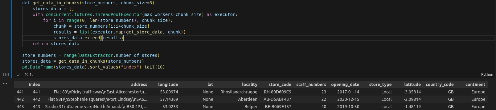

# Multinational Retail Data Centralisation

Table of Contents, if the README file is long


## The project
The aim of this project is to create a system that is capable of retrieving and cleaning data from multiple different sources before uploading it to an SQL database. It should allow users to access all of their data from one location, as well as cross-reference between multiple data types.

This repository contains various methods to access, collate and upload the data. The methods are stored in three different classes; DatabaseConnector, DataExtractor and DataCleaning. The classes themselves are stored in three seperate modules; database_utils, data_extraction and data_cleaning respectively.

While building this repo, I have learned a great deal about class functionality; having become more confident in the practical use of classmethods and staticmethods from implementing them to optimise code runtime. This has also been my one of my first practical experiences of data cleaning, and has demonstrated the importance of being able to efficiently seperate and categorise large quantities of data by using both common and unique characteristics. 

Since the DataExtractor class needed to be capable of extracting data from multiple different formats, it was necessary to create individual methods that will retrieve these types of data. 

Whilst working on the code for the 'retrieve_stores_data' method, I encountered a problem; there didn't appear to be any documentation supplied with the API information, all I had to work with was a set of headers and an API endpoint. 

Initially, I tried using a 'for' loop in a list comprehension to iterate through each entry, but since the loop had to run 451 times and the connection needed to be inside the loop, this was taking up to 3 minutes to execute.

I tried a few common methods to connect to multiple endpoints at once, but none of them were compatible with the API.
After some research, I discovered that I was able to use the 'ThreadPoolExecutor' method of the 'concurrent.futures' extension to connect to the API multiple times at once to eliminate the need for a loop.


This, however, presented a new problem. Once the database had been extracted using 'ThreadPoolExecutor', several of the row values had changed to NaN and a new series 'message' had been created.
On the NaN rows, the value in 'message' read 'Too Many Requests'.

So now I was capable of retrieving either a complete dataframe in 3 minutes or a dataframe with missing entries in 30 seconds, I figured that I must be able to use both methods together to find a compromise between the two.

I reworked the code to allow me to trial-and-error the 'chunk_size' until I found the largest chunk that would still collect all of the data. After some trial-and-error, this turned out to be 4.


Once I had incorporated these changes, the runtime for this method was cut down to less than a minute.


A description of the project: what it does, the aim of the project, and what you learned


## Installation instructions


## Usage instructions


## File structure of the project
#### database_utils.py
This module contains the DatabaseConnector class, which contains various methods for reading credentials, connecting to Amazon RDS and uploading to PostgreSQL.

### data_extraction.py
This contains the DataExtractor class, 
```
class DataExtractor:
```
which is comprised of several methods capable of retrieving data from multiple different formats, including Amazon S3, Amazon RDS, public PDF documents and APIs. 
```
read_rds_table(table_name, dbc)
```
Takes a table name and an instance of the DatabaseConnector class as arguments and returns the relevant table from Amazon RDS as a Pandas DataFrame.
```
retrieve_pdf_data(link)
```
Takes a PDF link as an argument and returns the information as a Pandas DataFrame.
```
list_number_of_stores(no_of_stores_endpoint, headers_dictionary)
```
Takes an API endpoint and headers dictionary as arguments and returns the number of available records
```
retrieve_stores_data(endpoint, headers)
```
Takes an API endpoint and headers dictionary as arguments, returning a Pandas DataFrame containing the information from the API.
```
extract_from_s3(address)
```
Takes an Amazon S3 address as an argument and casts the information into a Pandas DataFrame


#### data_cleaning.py
The data_cleaning module contains the DataCleaning class, which holds a variety of separate methods for cleaning all of the data retrieved from the various sources.

### License information
